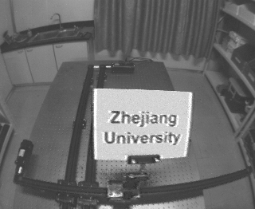

# E2R Frame generation

## Description

This repository aims to create a pipeline to pass in a color video with correspondting events and return a high frame rate, deblurred color video in return. The necessary impelentations for this procedure can easily be adapted to be used with ROS/ROS2 by writing respective wrappers.

Image with motion blur:


Image after deblurring:


## Installation
1. ### Clone the repository.
```
git clone git@github.com:eshan-savla/e2r_frame_generation.git
```

2. ### Installing dependenceis:
#### C++:
This repository requires the OpenCV library along with non-free modules, which need to be built from source. The following steps can be taken to install the library
```
sudo apt update && sudo apt install -y cmake g++ wget unzip
sudo apt purge libopencv-dev
mkdir -p ~/OpenCV && cd ~/OpenCV
wget -O opencv.zip https://github.com/opencv/opencv/archive/4.x.zip
wget -O opencv_contrib.zip https://github.com/opencv/opencv_contrib/archive/4.x.zip
unzip opencv.zip
unzip opencv_contrib.zip
rm -rf opencv.zip
rm -rf opencv_contrib.zip
mkdir -p build && cd build
cmake -DOPENCV_EXTRA_MODULES_PATH=../opencv_contrib-4.x/modules -DOPENCV_ENABLE_NONFREE=On ../opencv-4.x
make
sudo make install
```

#### Python:
All python dependencies can be installed into a virtual environment using the setup_env.bash script as follows:
```
bash ./setup_env.bash
```

3. Build the project using the build system of your choice.
While the python scripts require no compiling, a CMakeLists.txt file has been provided to compile and run the colorizer library. It can be built as follows:
```
mkdir -p build && cd build
cmake <build type flags> ..
make
```

```
events_obj = FrameGenerator(c_threshold=0.17, delta_eps=0.0)
events_obj.loadEventsFromFile(path_to_file="../data/1-3-circle-50-zju.h5")
events_obj.loadImgMetaData(path_to_file="../data/1-3-circle-50-zju.h5")
```

Reconstructing high frame rate video:
```
frames = []
frames_generator = events_obj.generateFramesByImg(num_events=100)
for frames in frames_generator:
    frames.extend(frames)
```

The file FrameGenerator.py under ./e2r_frame_generation/ contains the class implementation of FrameGenerator but also can be used as a standalone script to evaluate the performance of the deblurring quality and frame generation.

#### Using colorizer:
The colorizer method is implemented in c++ and requires a black and white colored image and a colored reference image. The executable object named ImgColorizer_test in the build directory can be run to test the results of the method.

The Colorizer library can be accessed an utilized as follows:
```
#include "Colorizer.h"
using namespace colorizer;
int main(int argc, char* argv[]){

    cv::Mat reference_img = cv::imread("../data/frames_00000000018.png");
    cv::cvtColor(reference_img, reference_img, cv::COLOR_BGRA2BGR);
    Colorizer colorizer = Colorizer(reference_img);
    cv::Mat input_img = cv::imread("../data/frames_0000000028.png", cv::IMREAD_GRAYSCALE);
    cv::Mat output_img;
    colorizer.colorizeGreyScale(input_img, output_img);
    cv::imwrite("../data/frames_0000000028_colorized.png", output_img);
}
```

It is important to note, that this colorizer method is not fully implemented. It only transfers colors to the centre of superpixels, but does not spread them. Implementation was abandoned due to high time complexity and processing costs, which made it unusable for real-time or near real-time applications.

## Future work:
- Implement alternative colorization method which can be used in real-time, near-real time situations.
- Improve deblurring approximation and frame generation accuracy.
- Implement automatic intensity threshold optimization
- Write ROS-Wrappers for entire pipeline in ROS/ROS2
